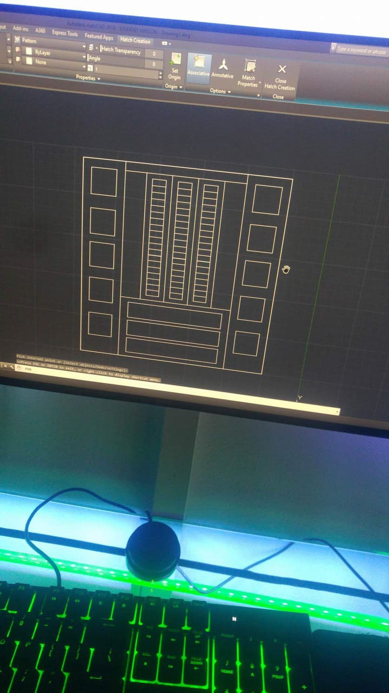
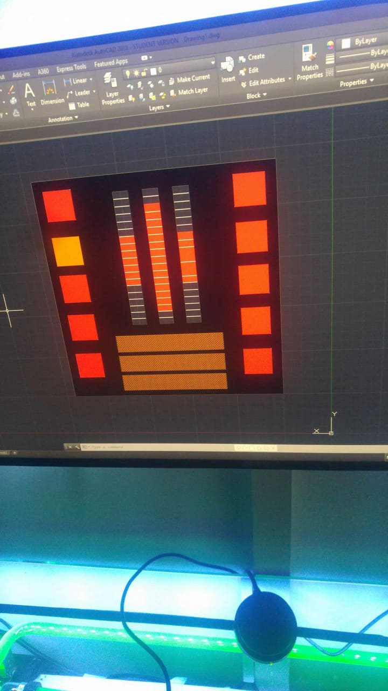
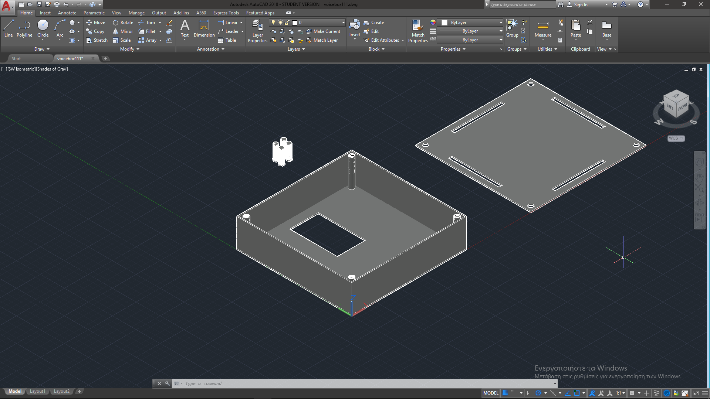
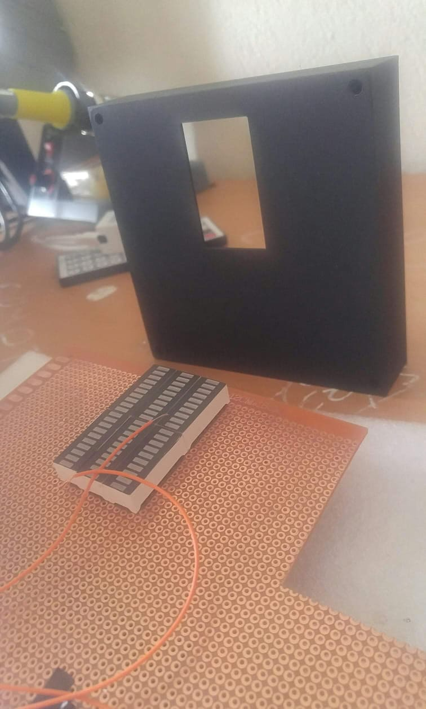
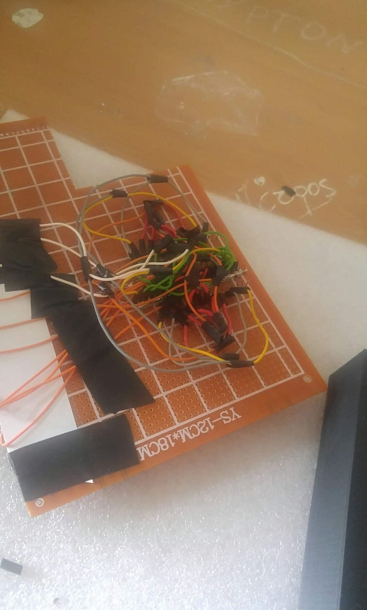
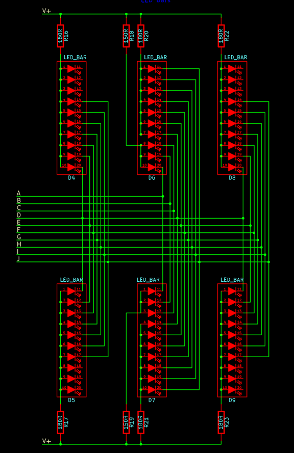
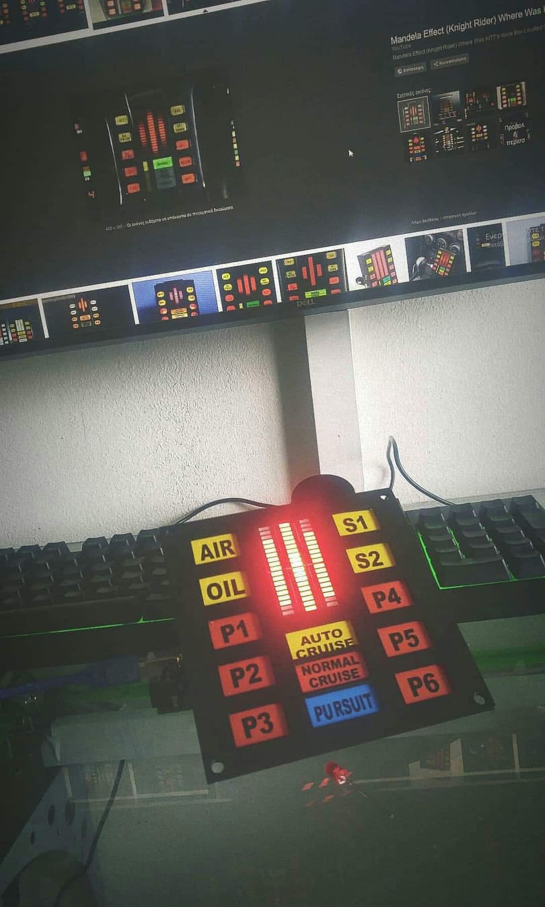

# knight-rider-voice-box-
knight rider voice box~

How start:

First you have to download the stl folder and simple print the file 

you have to buy those 10 led segmend (6 oof them)

later you have to do the wiring 

i know its looks messy :P thats why i ahve the sketch 

then just coonect the 10 outputs from the 10 led segments to the arduino pins what i have inthe code 

and you are ready to go ;)

YOU have to use a audio jack for the analog input and then usb cable  to power up the arduino 

so you can simple put the audio jack to your phone or pc and see the wafe coming out the music :)
